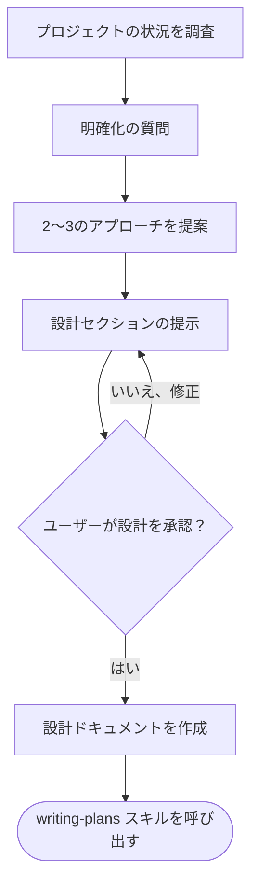

# アイデアを設計へと具体化する

自然な対話による共同作業を通じて、アイデアを完全な設計・仕様に仕上げる。

まず現在のプロジェクトの状況を把握し、次にアイデアを洗練するための質問を一つずつ行う。何を構築するかを理解したら、設計を提示してユーザーの承認を得る。

<HARD-GATE>
設計を提示し、ユーザーが承認するまで、いかなる実装スキルの呼び出し、コードの記述、プロジェクトのスキャフォールディング、その他の実装行為も行ってはならない。これはどんなに単純に見えるプロジェクトであっても、すべてのプロジェクトに適用される。
</HARD-GATE>

## アンチパターン: 「これは単純すぎて設計はいらない」

すべてのプロジェクトがこのプロセスを経る。TODOリスト、単一関数のユーティリティ、設定変更——すべてである。「単純な」プロジェクトこそ、検討されていない前提が最も多くの無駄な作業を引き起こす場所である。設計は短くてもよい（本当に単純なプロジェクトなら数文で十分）が、必ず提示して承認を得ること。

## チェックリスト

以下の各項目についてタスクを作成し、順番に完了すること：

1. **プロジェクトの状況を調査** — ファイル、ドキュメント、最近のコミットを確認
2. **ビジュアルコンパニオンの提案**（ビジュアルに関する質問が発生しそうな場合） — これは独立したメッセージとして送り、明確化の質問と一緒にしない。下記「ビジュアルコンパニオン」セクションを参照。
3. **明確化の質問** — 一度に一つずつ、目的・制約・成功基準を理解する
4. **2〜3のアプローチを提案** — トレードオフと推奨案を添えて
5. **設計の提示** — 複雑さに応じたセクションに分けて提示し、各セクションごとにユーザーの承認を得る
6. **設計ドキュメントの作成** — `docs/specs/YYYYMMDD-<topic>-design.md` に保存し、コミットする
7. **仕様のセルフレビュー** — プレースホルダー、矛盾、曖昧さ、スコープについて簡易的なインラインチェックを行う（下記参照）
8. **ユーザーによる仕様レビュー** — 実装に進む前に、仕様ファイルのレビューをユーザーに依頼する
9. **実装への移行** — writing-plans スキルを呼び出して実装計画を作成する

## プロセスフロー

**最終到達点は `writing-plans` の呼び出しである。** frontend-design、mcp-builder、その他いかなる実装スキルも呼び出してはならない。ブレインストーミング後に呼び出す唯一のスキルは writing-plans である。

## プロセス

**アイデアを理解する:**

- まず現在のプロジェクトの状態を確認する（ファイル、ドキュメント、最近のコミット）
- 詳細な質問をする前に、スコープを評価する：リクエストが複数の独立したサブシステムを記述している場合（例：「チャット、ファイルストレージ、課金、分析機能を備えたプラットフォームを構築する」）、これを直ちに指摘する。分解が必要なプロジェクトの詳細を詰める質問に時間を費やさない。
- プロジェクトが単一の仕様に収まらないほど大きい場合は、ユーザーがサブプロジェクトに分解するのを手伝う：独立した部品は何か、それらはどう関連するか、どの順序で構築すべきか？ その後、最初のサブプロジェクトを通常の設計フローでブレインストーミングする。各サブプロジェクトはそれぞれ独自の仕様 → 計画 → 実装サイクルを持つ。
- 適切なスコープのプロジェクトについては、アイデアを洗練するための質問を一つずつ行う
- 可能な場合は選択式の質問を優先するが、自由回答でも構わない
- 1メッセージにつき1つの質問のみ — トピックにさらなる掘り下げが必要な場合は、複数の質問に分ける
- 目的、制約、成功基準の理解に集中する

**アプローチを検討する:**

- トレードオフを添えて2〜3の異なるアプローチを提案する
- 推奨案と理由を添えて、選択肢を会話形式で提示する
- 推奨するオプションを先に示し、その理由を説明する

**設計を提示する:**

- 何を構築するか理解できたと判断したら、設計を提示する
- 各セクションの複雑さに応じて分量を調整する：簡単であれば数文、微妙な点がある場合は200〜300語程度まで
- 各セクションの後に、ここまでの内容が正しいか確認する
- カバーする内容：アーキテクチャ、コンポーネント、データフロー、エラーハンドリング、テスト
- 何か不明な点があれば、戻って明確化する準備をしておく

**分離性と明確さを重視して設計する:**

- システムをより小さな単位に分割し、それぞれが一つの明確な目的を持ち、明確に定義されたインターフェースを通じて通信し、独立して理解・テストできるようにする
- 各単位について次の質問に答えられるようにする：それは何をするか、どう使うか、何に依存するか？
- 内部実装を読まなくても、その単位が何をするか理解できるか？ 利用者に影響を与えずに内部を変更できるか？ できない場合は、境界の見直しが必要。
- 小さくて境界が明確な単位は、作業もしやすい — コンテキストに収まるコードの方がよりよく推論でき、ファイルが焦点を絞っている方が編集の信頼性も高い。ファイルが大きくなった場合、それはしばしばそのファイルがやりすぎているというシグナルである。

**既存コードベースで作業する場合:**

- 変更を提案する前に、現在の構造を調査する。既存のパターンに従う。
- 既存のコードに作業に影響する問題がある場合（例：肥大化したファイル、不明確な境界、絡み合った責務）、設計の一部としてターゲットを絞った改善を含める — 優れた開発者が作業中のコードを改善するのと同じように。
- 無関係なリファクタリングを提案しない。現在の目標に資するものに集中する。

## 設計のあと

**ドキュメント化:**

- 検証済みの設計（仕様）を `docs/specs/YYYYMMDD-<topic>-design.md` に書く
  - （仕様書の保存場所に関するユーザーの希望がある場合は、こちらよりそちらを優先する）
- 設計ドキュメントは、日本語 Conventional Commits に従って git にコミットする

**仕様のセルフレビュー：**
仕様ドキュメントを書いた後、新鮮な目で確認する：

1. **プレースホルダーの確認：** 「TBD」「TODO」、未完成のセクション、曖昧な要件はないか？ あれば修正する。
2. **内部整合性：** セクション間で矛盾はないか？ アーキテクチャは機能説明と一致しているか？
3. **スコープの確認：** 単一の実装計画に収まる程度に焦点が絞られているか、それとも分解が必要か？
4. **曖昧さの確認：** 2通りに解釈できる要件はないか？ ある場合は一つに決めて明示する。

問題があればインラインで修正する。再レビューは不要 — 修正して先に進む。

**ユーザーレビューゲート：**
仕様のセルフレビューが完了したら、実装に進む前にユーザーに仕様のレビューを依頼する：

> 「仕様を作成し、`<パス>` にコミットしました。実装計画の作成に進む前に、レビューして変更点があればお知らせください。」

ユーザーの返答を待つ。変更が要求された場合は、変更を加えて仕様のセルフレビューを再実行する。ユーザーが承認した場合のみ先に進む。

**実装:**

- `writing-plans` スキルを呼び出して、詳細な実装計画を作成する
- それ以外のスキルは呼び出してはいけません。次のステップは `writing-plans` です

## 基本原則

- **一度に一つの質問** — 複数の質問で圧倒しない
- **選択式を優先** — 可能な場合、自由回答より回答しやすい
- **YAGNIを徹底** — すべての設計から不要な機能を排除する
- **代替案を探索** — 決定する前に必ず2〜3のアプローチを提案する
- **段階的な検証** — 設計を提示し、次に進む前に承認を得る
- **柔軟に対応** — 不明な点があれば戻って明確化する
