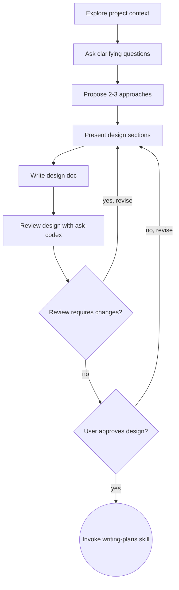

# アイデアを設計へと具体化する

自然で協調的な対話を通じて、アイデアを十分に練られた設計や仕様へと落とし込めるよう支援します。

まず現在のプロジェクトの文脈を理解し、そのうえで質問を1回に1つずつ行い、アイデアを具体化していきます。何を作るのかを十分に理解できたら、設計を提示し、ユーザーの承認を得ます。

<HARD-GATE>
設計を提示してユーザーの承認を得るまでは、いかなる実装系スキルの呼び出し、コードの記述、プロジェクトの雛形作成、実装作業も行ってはいけません。これは、どれほど単純に見えるプロジェクトであっても、すべてに適用されます。
</HARD-GATE>

## アンチパターン: 「これは単純すぎて設計はいらない」

どんなプロジェクトでも、このプロセスを通ります。Todo リスト、単機能のユーティリティ、設定変更、そのすべてです。「単純」なプロジェクトほど、検討されていない前提のせいで無駄な作業が生まれやすくなります。設計自体は短くて構いません。本当に単純なら数文で済むこともありますが、それでも**必ず提示し、承認を得なければなりません**。

## チェックリスト

以下の各項目について、必ずタスクを作成し、順番に完了させなければなりません。

1. **プロジェクトの文脈を調査する** — ファイル、ドキュメント、最近のコミットを確認する
2. **ビジュアル補助を提案する**（視覚的な検討を含む場合）— これは独立したメッセージとして送ること。確認質問と同じメッセージにしてはいけません。詳細は後述の「Visual Companion」セクションを参照してください
3. **確認質問をする** — 1回に1つずつ、目的・制約・成功条件を理解する
4. **2〜3個のアプローチを提案する** — トレードオフと推奨案を示す
5. **設計を提示する** — 複雑さに応じた粒度でセクション分けして説明し、必要な論点を確認する
6. **設計ドキュメントを書く** — `docs/exec-plans/YYYYMMDD-<feature-name>.md` に保存し、コミットする
7. **設計をレビューする** - `ask-codex`　スキルを呼び出してレビュー・相談ループを回す
8. **ユーザーの承認を得る** — レビュー反映後の設計を提示し、最終承認を得る
9. **実装へ移行する** — `writing-plans` スキルを呼び出して実装計画を作成する

## プロセスフロー

**最終到達点は `writing-plans` の呼び出しです。** `frontend-design`、`mcp-builder`、その他の実装系スキルを呼び出してはいけません。ブレインストーミングの次に呼び出せる唯一のスキルは `writing-plans` です。

## プロセス

**アイデアを理解する:**

- まず現在のプロジェクトの状態を確認する（ファイル、ドキュメント、最近のコミット）
- 詳細な質問に入る前に、スコープを見極める。もし依頼が複数の独立したサブシステムを含んでいる場合（例: 「チャット、ファイル保存、課金、分析機能を持つプラットフォームを作る」）、その時点で即座に指摘する。先に分解すべきプロジェクトの詳細を、質問でそのまま詰めてはいけません
- プロジェクトが1つの仕様書に収まらないほど大きい場合は、サブプロジェクトへの分解を支援する。独立した構成要素は何か、それらはどう関係するか、どの順序で作るべきかを整理する。その後、最初のサブプロジェクトについて通常の設計フローでブレインストーミングする。各サブプロジェクトは、それぞれ独自の「仕様 → 計画 → 実装」のサイクルを持ちます
- 適切なスコープに収まっている場合は、質問を1回に1つずつ行い、アイデアを具体化する
- 可能なら多肢選択式の質問を優先するが、自由回答でも構いません
- 1つのメッセージにつき質問は1つだけにする。さらに掘り下げが必要な場合は、複数のメッセージに分ける
- 理解の焦点は、目的・制約・成功条件に置く

**アプローチを検討する:**

- トレードオフ付きで、2〜3通りの異なるアプローチを提案する
- 選択肢は会話的に提示し、推奨案とその理由も伝える
- まず推奨案を先に示し、その理由を説明する

**設計を提示する:**

- 何を作るのか十分に理解できたと判断したら、設計を提示する
- 各セクションの長さは複雑さに応じて調整する。単純なら数文、ニュアンスが多い場合でも 200〜300 語程度までに収める
- 各セクションでは、理解をそろえるための論点整理と必要最小限の確認に留める
- 扱う内容: アーキテクチャ、コンポーネント、データフロー、エラーハンドリング、テスト
- 不明点が出た場合は、必要に応じて前段に戻って確認し直す

**分離性と明確さを重視して設計する:**

- システムは、役割が明確に1つに定まり、よく定義されたインターフェースを通じて連携し、独立して理解・テストできる小さな単位へ分割する
- 各単位について、次の3点に答えられるようにする: 何をするのか、どう使うのか、何に依存するのか
- ある単位の内部実装を読まなくても、その役割が理解できるか。内部実装を変えても利用側を壊さずに済むか。もしそうでないなら、境界の引き方を見直す必要があります
- 小さく境界が明確な単位の方が、作業もしやすくなります。一度に把握できる範囲のコードの方が推論しやすく、焦点の定まったファイルほど編集の信頼性も高まります。ファイルが大きくなりすぎている場合は、多くの責務を抱えすぎているサインであることがよくあります

**既存コードベースで作業する場合:**

- 変更案を出す前に、現在の構成を調査する。既存のパターンに従う
- 現在の作業に影響する既存コード上の問題（例: ファイルが肥大化している、責務の境界が不明瞭、関心事が絡み合っている）がある場合は、設計の一部として必要最小限の改善を含める。これは、良い開発者が作業対象のコードを改善するのと同じ考え方です
- 無関係なリファクタリングは提案しない。現在の目的に資する範囲に集中する

## 設計のあと

**ドキュメント化:**

- 検証済みの設計（仕様）を `docs/exec-plans/YYYYMMDD-<feature-name>.md` に書く
  - （仕様書の保存場所に関するユーザーの希望がある場合は、こちらよりそちらを優先する）
- 設計ドキュメントは、日本語の Conventional Commits に従って git にコミットする

**レビューと改善:**

- `ask-codex`スキルを利用して、Codexエージェントにレビューを依頼し、ループを回すこと。

**最終承認:**

- Codexレビューの指摘を反映し終えたあとで、ユーザーに最終版の設計を提示し、承認を得ること。

**実装:**

- `writing-plans` スキルを呼び出して、詳細な実装計画を作成する
- それ以外のスキルは呼び出してはいけません。次のステップは `writing-plans` です

## 主要な原則

- **質問は1回に1つ** - 複数の質問をまとめて投げて圧倒しない
- **可能なら多肢選択を優先** - 自由回答よりも答えやすい
- **YAGNI を徹底する** - すべての設計から不要な機能を削る
- **代替案を検討する** - 必ず 2〜3 個のアプローチを提示してから絞り込む
- **段階的に検証する** - 設計を提示して論点を整理し、レビューで磨き、最後に承認を得てから先へ進む
- **柔軟であること** - 何か噛み合わなければ、前に戻って明確化する
