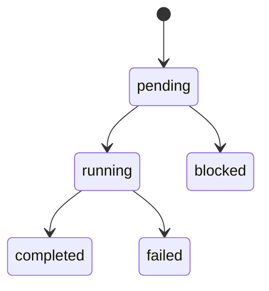

# ブランチ差分からドキュメントを更新する

このスキルの役割は、コード差分をそのまま文章化することではありません。
実装から読み取れる「利用者や開発者が知るべき意味」を抜き出し、正本人間用ドキュメントへ過不足なく反映することです。

## 先に押さえる前提

- まず `README.md`、`docs/DESIGN.md` を読む。
- `docs/exec-plans/` は詳細設計・実装計画の置き場であり、正本の代替として扱わない。
- ドキュメントは実装の逐語的な写経ではなく、構造・責務・制約・振る舞いの理解を支えるものとして更新する。
- 詳細すぎる説明は避ける。コード変更へ追従しにくい粒度の記述は、将来の腐敗要因になる。
- 変更のない領域までついでに書き換えない。必要最小限に留める。

## いつ使うか

次のような依頼では、このスキルを優先して使う。

- 「このブランチの変更を docs に反映して」
- 「仕様書や設計書の更新漏れを見て」
- 「README と DESIGN をコードに合わせて更新したい」
- 「差分を洗って、どのドキュメントを直すべきか整理して」
- 「Mermaid や表で分かりやすく設計を追記して」

## 成果物

このスキルが目指す成果物は次のいずれかです。

- 更新済みのドキュメント
- 「どの文書を、なぜ更新したか」が分かる簡潔な変更サマリ
- 更新不要と判断した場合の明確な理由

## 粒度ガードレール

特に `docs/DESIGN.md` を更新するときは、次の粒度を厳守する。

- 原則として「責務・構成・画面導線・データフロー」の中粒度で記述する。
- APIの具体パス、内部ステップID、関数名、例外コードなど実装依存の詳細は書かない。
- 上記の詳細は、外部インターフェース契約として固定で共有する必要がある場合だけ例外的に記載する。
- 迷ったら「この記述は2〜3回の実装変更で腐らないか」を基準に削る。

## 変更の仕分け

差分を見たら、まず次の 4 区分に分ける。

| 区分           | 何を指すか                                       | 典型例                                                      | 文書更新   |
| -------------- | ------------------------------------------------ | ----------------------------------------------------------- | ---------- |
| 既存仕様の変更 | 既存機能の振る舞いや制約が変わる                 | 状態遷移変更、入力条件変更、画面表示ルール変更              | 必要       |
| 新規追加       | 利用者や開発者が新しく知るべき機能・責務が増える | 新画面、新API、新データ種別、新運用手順                     | 必要       |
| 構造変更       | 外から見た責務や構成の理解が変わる               | データフロー変更、コンテナ再設計、役割分割                  | 必要       |
| 実装詳細のみ   | 内部実装に閉じた変更                             | private helper 追加、テスト追加、変数名変更、軽微なログ修正 | 通常は不要 |

## 実行フロー

### 1. 差分の基準を定める

- ユーザー指定があれば、その比較対象ブランチやコミットを使う。
- 指定がなければ、現在ブランチと既定のベースブランチとの差分を調べる。
- 変更ファイル一覧だけで終わらず、主要コミットメッセージや関連する実装ファイルも読んで意図を掴む。

### 2. ドキュメントの責務を確認する

- まず `README.md`、`docs/DESIGN.md` を読む。
- 変更領域に対応する既存セクションを特定する。
- 詳細な背景が必要なときだけ `docs/exec-plans/` や `docs/specs` や `docs/adr` を参照する。

### 3. 変更マップを作る

編集前に、頭の中またはメモとして次の表を作る。

| change_type    | summary            | evidence                   | target_docs          | action                 |
| -------------- | ------------------ | -------------------------- | -------------------- | ---------------------- |
| 既存仕様の変更 | 何がどう変わったか | 実装差分、テスト、コミット | README / DESIGN など | 追記 / 修正 / 更新不要 |

このマップの目的は、事実の列挙ではなく「どの理解が変わるか」を整理することです。

### 4. どこまで書くかを決める

- 利用者・運用者・将来の開発者にとって重要な変化だけを書く。
- 一時的な実装都合、関数分割、クラス名の細かな変更は書かない。
- 数週間後にコードが少し変わっても陳腐化しにくい表現を選ぶ。
- 既存セクションの言い換えで済むなら、新しい章を増やさない。

### 5. 図表中心に更新する

理解を助けるために、Markdown テーブルや Mermaid を積極的に使う。

**Markdown テーブルを使う場面**

- 役割比較
- 変更前後比較
- 画面一覧
- データ種別や状態一覧
- 文書ごとの更新対象整理

**Mermaid を使う場面**

- アーキテクチャ構成
- データフロー
- 画面遷移
- 状態遷移
- 処理シーケンス

**Mermaid 利用時の方針**

- 文章をそのまま図に写すのではなく、関係性や流れが一目で分かる内容だけ図にする。
- ノード名は短く保ち、補足は前後の本文で説明する。
- 変更点が局所的なら、図全体を描き直すより既存図の意味を保って更新する。

### 6. 実際に更新する

- 既存の章や表を優先して更新する。
- 同じ内容を別の場所に重複記載しない。
- 新規追加点は、既存の情報設計に沿って収まる場所へ入れる。
- 用語は実装と既存文書の両方に合わせて揃える。

### 7. 更新要否を検証する

編集後に次を確認する。

- 差分で重要だった変更がドキュメントに反映されているか
- 実装詳細に寄りすぎていないか
- 既存ドキュメントと矛盾する古い説明を残していないか
- Mermaid や表が本文より分かりにくくなっていないか
- 更新不要とした領域に、見落としがないか

## 書き方のルール

### 良い書き方

- なぜこの変更が必要かが分かる
- 何が利用者視点で変わるかが分かる
- どの責務がどこへ移ったかが分かる
- 表や図で比較しやすい
- コードを読まなくても全体像を掴める

### 避ける書き方

- メソッド名や内部処理順序を細かく追いかける
- APIエンドポイント文字列、内部ステップID、ジョブ種別定数など実装依存の識別子を直接書く
- 実装ファイル単位の変更履歴を延々と書く
- テストケースの内容をそのまま仕様書に持ち込む
- 将来未確定の案を、確定事項のように書く
- コード断片がないと意味が通らない説明にする

## 出力の進め方

ユーザーへの提示は次の順を基本にする。

1. 差分から読み取れた主要変更を簡潔に整理する
2. 更新対象ドキュメントと更新理由を示す
3. 必要なら短い更新プランを共有する
4. ドキュメントを更新する
5. 最後に「何を更新し、何を更新しなかったか」を要約する

## 更新不要と判断してよい例

- テスト追加のみ
- リファクタリングのみ
- ログ文言や例外文言の微修正のみ
- private 関数や補助クラスの追加のみ
- ドキュメントの責務に影響しない性能改善のみ

更新不要のときも、理由は明示する。

## 簡易テンプレート

### 更新対象整理

```markdown
| 変更点               | 種別           | 更新対象                      | 理由                                         |
| -------------------- | -------------- | ----------------------------- | -------------------------------------------- |
| 進捗初期化ルール変更 | 既存仕様の変更 | `README.md`, `docs/DESIGN.md` | 利用者に見える状態遷移と設計責務が変わるため |
```

### 状態遷移の表現例



### 比較表の例

```markdown
| 観点     | 変更前         | 変更後                             |
| -------- | -------------- | ---------------------------------- |
| 初期状態 | 全工程が未着手 | 先頭のみ開始待ち、後続は前工程待ち |
```

## 迷ったときの優先順位

1. ドキュメントの責務に沿っているか
2. 人間が理解しやすいか
3. 数回の実装変更でも腐りにくいか
4. 図表が本当に理解を助けているか
5. 過剰記述になっていないか
