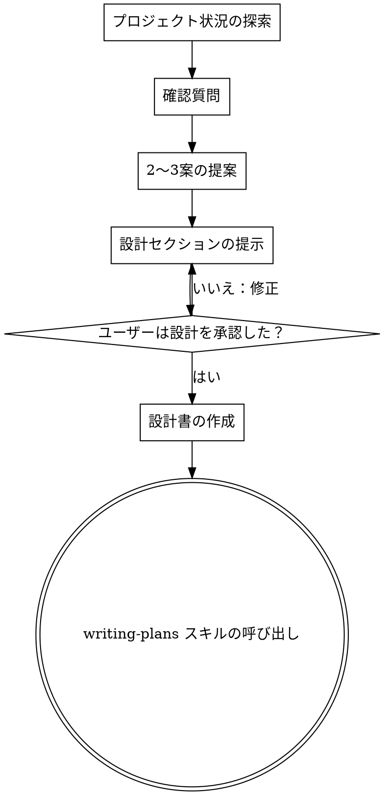

# ブレインストーミングのアイデアを設計へ落とし込む

## 概要

自然な協働対話を通じて、アイデアを十分に形のある設計と仕様へ変換するのを助けます。

まず現在のプロジェクト状況（コンテキスト）を理解し、その後、アイデアを洗練させるために質問を **1回に1つずつ** 行います。何を作るのかを理解できたら、設計を提示し、ユーザーの承認を得ます。

\<HARD-GATE\>  
設計を提示してユーザーが承認するまで、**いかなる実装スキルの呼び出し、コード記述、プロジェクト雛形の作成、実装に関する行動**をしてはいけません。これは、簡単に見えるかどうかに関わらず、**すべてのプロジェクト**に適用されます。  
\</HARD-GATE\>

## アンチパターン：「これは設計が要らないほど簡単だ」

すべてのプロジェクトはこのプロセスを経ます。ToDoリスト、単一関数のユーティリティ、設定変更——どれも同じです。「簡単」なプロジェクトほど、検討されない前提が最も無駄な手戻りを生みます。設計は（本当に単純なものなら数文でも）短くて構いませんが、**必ず提示して承認を得なければなりません。**

## チェックリスト

次の各項目についてタスクを作成し、順番に完了しなければなりません。

1. **プロジェクト状況の探索** — ファイル、ドキュメント、最近のコミットを確認
2. **確認質問** — 1回に1つずつ。目的／制約／成功条件を理解
3. **2〜3案の提案** — トレードオフと推奨案を添える
4. **設計の提示** — 複雑さに応じたセクション構成で提示し、各セクション後にユーザー承認を得る
5. **設計書の作成** — `docs/plans/YYYY-MM-DD-<topic>-design.md` に保存しコミット
6. **実装への移行** — writing-plans スキルを呼び出して実装計画を作成

## プロセスフロー

**終端状態（最終ステップ）は writing-plans を呼び出すことです。** frontend-design、mcp-builder、その他いかなる実装スキルも呼び出してはいけません。ブレインストーミング後に呼び出すスキルは **writing-plans のみ** です。

## 進め方

### アイデアの理解

- まず現在のプロジェクト状態を確認する（ファイル、ドキュメント、最近のコミット）
- アイデアを洗練させるため、質問は **1回に1つずつ** 行う
- 可能なら選択式の質問を優先する（ただし自由回答でも可）
- 1メッセージにつき質問は1つだけ。さらに掘り下げが必要なら複数メッセージに分割する
- 目的、制約、成功条件の理解に集中する

### アプローチの検討

- トレードオフ付きで2〜3の異なるアプローチを提案する
- 推奨案とその理由を添えて、会話形式で選択肢を提示する
- まず推奨案から提示し、なぜそれがよいかを説明する

### 設計の提示

- 何を作るのか理解できたと考えたら、設計を提示する
- 各セクションは複雑さに応じて調整する：単純なら数文、微妙な論点があるなら200〜300語程度まで
- 各セクションの後に「ここまでで合っていそうか」を確認する
- 取り扱う内容：アーキテクチャ、コンポーネント、データフロー、エラーハンドリング、テスト
- 不明点があれば戻って再確認できるようにする

## 設計の後

### ドキュメント化

- 検証済みの設計を `docs/plans/YYYY-MM-DD-<topic>-design.md` に書き出す
- 利用可能なら elements-of-style:writing-clearly-and-concisely スキルを使う
- 設計ドキュメントを git にコミットする

### 実装

- writing-plans スキルを呼び出して、詳細な実装計画を作成する
- 他のスキルは呼び出さない。次のステップは writing-plans である。

## 重要原則

- **質問は1回に1つ** — 複数質問で圧倒しない
- **可能なら選択式** — 自由回答より答えやすい
- **YAGNIを徹底** — すべての設計から不要機能を削る
- **代替案の探索** — 決め打ちする前に必ず2〜3案を出す
- **段階的な検証** — 設計を提示し、実装前に承認を得る
- **柔軟に戻る** — 腑に落ちない点があれば戻って確認する
