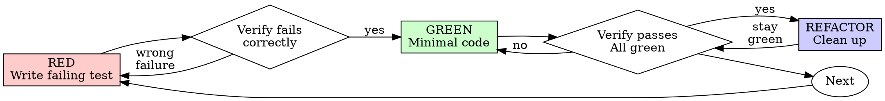

# テスト駆動開発（TDD）

## 概要

最初にテストを書きます。失敗するのを確認します。通すための最小限のコードを書きます。

**中核原則:** テストが失敗するところを自分で確認していないなら、そのテストが本当に正しいものを検証しているかは分かりません。

**ルールの文言に反することは、その精神にも反しています。**

## いつ使うか

**常に使う場面:**

- 新機能
- バグ修正
- リファクタリング
- 振る舞いの変更

**例外（人間のパートナーに確認すること）:**

- 使い捨てのプロトタイプ
- 生成コード
- 設定ファイル

「今回だけ TDD を飛ばそう」と考えたなら、立ち止まってください。それは合理化です。

## 鉄の掟

```text
失敗するテストが先にない状態で、本番コードを書いてはいけない
```

テストより先にコードを書いたなら、消してください。やり直しです。

**例外はありません:**

- 「参照用」として残さない
- テストを書きながら「流用」しない
- 見返さない
- 消すとは、本当に消すことです

テストから新しく実装してください。以上です。

## Red-Green-Refactor



### RED - 失敗するテストを書く

何が起きるべきかを示す、最小のテストを1つ書きます。

<Good>
```typescript
test('失敗した処理を3回まで再試行する', async () => {
  let attempts = 0;
  const operation = () => {
    attempts++;
    if (attempts < 3) throw new Error('fail');
    return 'success';
  };

const result = await retryOperation(operation);

expect(result).toBe('success');
expect(attempts).toBe(3);
});

````
名前が明確で、実際の振る舞いをテストしており、焦点が1つに絞られている
</Good>

<Bad>
```typescript
test('retry works', async () => {
  const mock = jest.fn()
    .mockRejectedValueOnce(new Error())
    .mockRejectedValueOnce(new Error())
    .mockResolvedValueOnce('success');
  await retryOperation(mock);
  expect(mock).toHaveBeenCalledTimes(3);
});
````

名前が曖昧で、コードではなくモックをテストしている
</Bad>

**要件:**

- 1つの振る舞い
- 明確な名前
- 実コードを使う（避けられない場合を除き、モックは使わない）

### Verify RED - 失敗することを確認する

**必須です。絶対に省略しないでください。**

```bash
npm test path/to/test.test.ts
```

確認すること:

- テストが失敗していること（error ではない）
- 失敗メッセージが想定どおりであること
- タイポではなく、機能未実装が原因で失敗していること

**テストが通った？** それは既存の振る舞いをテストしています。テストを修正してください。

**テストが error になった？** エラーを直し、正しく失敗するまで再実行してください。

### GREEN - 最小限のコードを書く

テストを通すための最も単純なコードを書きます。

<Good>
```typescript
async function retryOperation<T>(fn: () => Promise<T>): Promise<T> {
  for (let i = 0; i < 3; i++) {
    try {
      return await fn();
    } catch (e) {
      if (i === 2) throw e;
    }
  }
  throw new Error('unreachable');
}
```
通すのに必要なだけ
</Good>

<Bad>
```typescript
async function retryOperation<T>(
  fn: () => Promise<T>,
  options?: {
    maxRetries?: number;
    backoff?: 'linear' | 'exponential';
    onRetry?: (attempt: number) => void;
  }
): Promise<T> {
  // YAGNI
}
```
過剰設計
</Bad>

機能を足したり、他のコードをリファクタしたり、テストの範囲を超えて「改善」したりしてはいけません。

### Verify GREEN - 通ることを確認する

**必須です。**

```bash
npm test path/to/test.test.ts
```

確認すること:

- テストが通る
- 他のテストも通ったままである
- 出力がきれいである（error や warning がない）

**テストが失敗した？** テストではなくコードを直してください。

**他のテストが壊れた？** 今すぐ直してください。

### REFACTOR - 整える

グリーンになってからだけ行います。

- 重複を取り除く
- 命名を改善する
- ヘルパーを抽出する

テストはグリーンのまま保ちます。振る舞いは増やさないでください。

### 繰り返す

次の機能に対して、次の失敗するテストを書きます。

## 良いテスト

| Quality          | Good                                | Bad                                                 |
| ---------------- | ----------------------------------- | --------------------------------------------------- |
| **Minimal**      | One thing. "and" in name? Split it. | `test('validates email and domain and whitespace')` |
| **Clear**        | Name describes behavior             | `test('test1')`                                     |
| **Shows intent** | Demonstrates desired API            | Obscures what code should do                        |

## なぜ順序が重要なのか

**「あとでテストを書いて、動くことを確認すればいい」**

コードのあとに書いたテストは、すぐ通ってしまいます。すぐ通るという事実は何も証明しません。

- 間違ったものをテストしているかもしれない
- 振る舞いではなく実装をテストしているかもしれない
- 忘れていたエッジケースを見逃しているかもしれない
- そのテストが本当にバグを捕まえるところを一度も見ていない

テストファーストは、テストが実際に何かを検証していることを、失敗を通じて証明させます。

**「エッジケースは手動で全部確認済み」**

手動テストは場当たり的です。全部試したつもりでも:

- 何を試したか記録が残らない
- コードが変わったときに再実行できない
- プレッシャー下では抜け漏れやすい
- 「自分が試したときは動いた」ことは、網羅性を意味しない

自動テストは体系的です。毎回同じ方法で実行されます。

**「何時間もかけたコードを消すのはもったいない」**

それは埋没費用の誤謬です。費やした時間はもう戻りません。今ある選択肢は次の2つです。

- 消して TDD で書き直す（さらに X 時間、高い信頼性）
- 残してあとからテストを足す（30 分、低い信頼性、バグが出やすい）

本当の「無駄」は、信頼できないコードを残すことです。ちゃんとしたテストのない動作コードは技術的負債です。

**「TDD は教条的すぎる。実用的に柔軟に対応すべきだ」**

TDD こそ実用的です。

- コミット前にバグを見つける（あとからデバッグするより速い）
- リグレッションを防ぐ（壊れたらすぐテストが検知する）
- 振る舞いをドキュメント化する（テストが使い方を示す）
- リファクタリングを可能にする（安心して変更できる）

「実用的」だと思っている近道は、本番でのデバッグにつながり、結果的に遅くなります。

**「あとから書くテストでも同じ目的は達成できる。重要なのは儀式ではなく精神だ」**

違います。あとから書くテストが答えるのは「これは何をするコードか？」です。先に書くテストが答えるのは「これは何をするべきか？」です。

あとから書くテストは、あなたの実装に引きずられます。要求ではなく、自分が作ってしまったものをテストすることになります。思い出せたエッジケースしか確認できず、実装前に発見できたはずの論点を拾えません。

テストファーストは、実装前にエッジケースを発見させます。あとからのテストは、あなたが全部覚えていたかを確認するだけです。覚えていません。

30 分であとからテストを書くことは、TDD ではありません。カバレッジは得られても、そのテストが機能するという証明は失われます。

## よくある合理化

| 言い訳                                 | 現実                                                                 |
| -------------------------------------- | -------------------------------------------------------------------- |
| "簡単すぎてテストはいらない"           | 単純なコードでも壊れます。テストは 30 秒で書けます。                |
| "あとでテストする"                     | すぐ通るテストは何も証明しません。                                   |
| "あとからでも同じ目的を達成できる"     | あとからのテスト = 「これは何をする？」 先のテスト = 「何をすべき？」 |
| "手動で十分確認した"                   | 場当たり対応は体系的ではありません。記録もなく、再実行もできません。 |
| "X 時間分を消すのはもったいない"       | 埋没費用の誤謬です。未検証のコードを残すのは技術的負債です。         |
| "参照用に残して先にテストを書けばいい" | どうせ流用します。それはあとからのテストです。消すなら本当に消す。   |
| "まず探索が必要だ"                     | それは構いません。探索コードは捨てて、そのあと TDD を始めます。      |
| "テストしにくい = 設計が不明瞭"        | その感覚を信じてください。テストしにくいものは使いにくいです。       |
| "TDD は遅くなる"                       | TDD はデバッグより速い。実用的であるとは、先にテストを書くことです。 |
| "手動テストの方が速い"                 | 手動ではエッジケースを証明できません。変更のたびに再確認が必要です。 |
| "既存コードにテストがない"             | 今から改善するのです。既存コードにもテストを追加してください。       |

## 赤信号 - 止まってやり直す

- テストより先にコードを書いた
- 実装後にテストを書いた
- テストが最初から通った
- なぜそのテストが失敗したのか説明できない
- テストを「あとで」追加した
- 「今回だけ」と合理化している
- 「手動では確認した」と言っている
- 「あとからでも同じ目的だ」と言っている
- 「精神が大事で儀式ではない」と言っている
- 「参照用に残す」または「既存コードを流用する」と言っている
- 「もう X 時間使ったから消すのは無駄だ」と言っている
- 「TDD は教条的で、自分は実用的にやっている」と言っている
- 「今回は事情が違うから」と言っている

**これらはすべて、コードを消して TDD でやり直すべきサインです。**

## 例: バグ修正

**バグ:** 空の email が受け付けられてしまう

**RED**

```typescript
test("空の email を拒否する", async () => {
  const result = await submitForm({ email: "" });
  expect(result.error).toBe("Email required");
});
```

**Verify RED**

```bash
$ npm test
FAIL: expected 'Email required', got undefined
```

**GREEN**

```typescript
function submitForm(data: FormData) {
  if (!data.email?.trim()) {
    return { error: "Email required" };
  }
  // ...
}
```

**Verify GREEN**

```bash
$ npm test
PASS
```

**REFACTOR**
必要なら、複数フィールド向けにバリデーションを抽出する。

## 検証チェックリスト

作業完了と見なす前に確認すること:

- [ ] 新しい関数 / メソッドにはすべてテストがある
- [ ] 実装前に各テストが失敗するところを確認した
- [ ] 各テストは想定どおりの理由で失敗した（タイポではなく機能未実装）
- [ ] 各テストを通すための最小限のコードを書いた
- [ ] すべてのテストが通る
- [ ] 出力がきれいである（error や warning がない）
- [ ] テストは実コードを使っている（避けられない場合のみモック）
- [ ] エッジケースとエラー系がカバーされている

すべてにチェックできないなら、TDD は飛ばされています。やり直してください。

## 行き詰まったとき

| 問題                     | 解決策                                                                 |
| ------------------------ | ---------------------------------------------------------------------- |
| どうテストすべきか分からない | 望ましい API を書く。先にアサーションを書く。人間のパートナーに相談する。 |
| テストが複雑すぎる         | 設計が複雑すぎます。インターフェースを単純にする。                     |
| 何でもモックしないといけない | コードが密結合すぎます。依存性注入を使う。                             |
| テスト準備が大がかりすぎる | ヘルパーを抽出する。それでも複雑なら設計を単純にする。                 |

## デバッグとの統合

バグを見つけたら、そのバグを再現する失敗テストを書いてください。そのうえで TDD サイクルに従います。テストは修正を証明し、リグレッションも防ぎます。

テストなしでバグを修正してはいけません。

## テストのアンチパターン

モックやテストユーティリティを追加するときは、よくある落とし穴を避けるために `@testing-anti-patterns.md` を読んでください。

- 実際の振る舞いではなく、モックの振る舞いをテストしてしまう
- 本番クラスにテスト専用メソッドを追加してしまう
- 依存関係を理解しないままモックしてしまう

## 最終ルール

```text
本番コード → その前にテストが存在し、しかも失敗を確認済み
そうでなければ → それは TDD ではない
```

人間のパートナーの許可がない限り、例外はありません。
